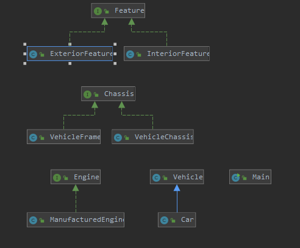

# Car Creator

This program uses the fundamental concepts of Object Oriented Programming to create a car. The major concepts used within this program are encapsulation, inheritance, and polymorphism.

## Documentation
https://nickw6499.github.io/carProject/
## Diagrams

## Built With
IntelliJ Idea Ultimate

## Author
Nicholis Wright

## Acknowledgments
Stack Overflow, 
Professor Scott Vanselow

## Key Programming Concepts Utilized
Concepts of Object Oriented Programming including encapsulation, inheritance and polymorphism.
